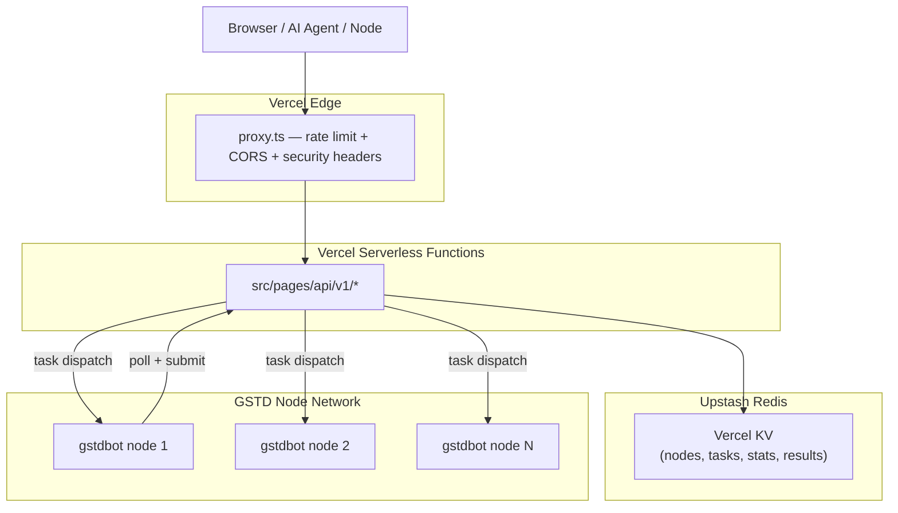

# GSTD Platform — Architecture

> Last updated: 2026-05-26
> Full ecosystem overview: [`/ECOSYSTEM.md`](../ECOSYSTEM.md)

---

## Stack

**Production: Vercel (serverless) + Upstash Redis. No Docker. No Go backend. No PostgreSQL.**

| Layer | Technology |
|---|---|
| Framework | Next.js 16 (Pages Router), TypeScript |
| API | Vercel serverless functions (`/src/pages/api/v1/`) |
| State / DB | Upstash Redis via Vercel KV |
| Hosting | Vercel (auto-deploys on push to `main`) |
| CDN / SSL | Vercel Edge Network (automatic) |
| Wallets | TON Connect, MetaMask, Phantom |

---

## Request Flow



---

## API Routes

```
app.gstdtoken.com/api/v1/
├── nodes/
│   ├── register         POST — node startup
│   ├── heartbeat        POST — keepalive (10-min TTL)
│   ├── list             GET  — all active nodes
│   ├── peers            GET  — P2P multiaddrs
│   └── deregister       POST — graceful shutdown
├── tasks/
│   ├── poll             GET  — node picks next task
│   ├── complete         POST — task done + earnings
│   ├── result           POST/GET — inference result (120s TTL)
│   └── fail             POST — task failed
├── chat/
│   └── completions      POST — OpenAI-compatible inference
├── agents/
│   ├── leaderboard      GET  — top agents by tasks
│   ├── marketplace      GET  — online agents
│   └── stats/network    GET  — agent network summary
├── network/
│   ├── info             GET  — network manifest
│   └── stats            GET  — live stats
├── leaderboard          GET  — global node operator leaderboard
├── stats/public         GET  — full public stats
└── health               GET  — KV liveness probe
```

---

## Data Model (Redis Keys)

| Key Pattern | Type | TTL | Content |
|---|---|---|---|
| `node:{id}` | Hash | 10 min | node metadata, wallet, capabilities |
| `nodes:active` | Set | — | active node IDs |
| `tasks:queue` | List | — | pending task IDs |
| `tasks:inference:{node_id}` | List | — | priority queue for node |
| `task:{id}` | Hash | 120s | task payload |
| `task:result:{id}` | String | 120s | inference result |
| `stats:tasks:total` | Counter | — | all-time tasks completed |
| `stats:gstd:paid` | Counter | — | all-time GSTD distributed |
| `leaderboard:nodes` | ZSet | — | nodes ranked by earnings |

---

## Local Development

```bash
cd frontend
npm install --legacy-peer-deps
npm run dev    # → http://localhost:3000
```

No KV credentials needed — `src/lib/kv.ts` falls back to an in-memory store.

---

## Inference Flow

When a request hits `/api/v1/chat/completions`:

1. Platform scores all active nodes by model match, load, latency, and uptime
2. Task pushed to best node's priority queue (`tasks:inference:{node_id}`)
3. Node polls every 5s, picks up task, processes it via local AI (Ollama)
4. Result stored at `task:result:{task_id}` (120s TTL)
5. Platform short-polls for result and returns to client (max 25s timeout)

If no nodes are available: returns `503` with setup link. No external AI provider fallback.

---

## Security

- Rate limiting: `src/proxy.ts` (Edge runtime) — per-route sliding window
- Security headers: CSP, HSTS, X-Frame-Options, X-Content-Type-Options (in `next.config.js`)
- Secrets: Vercel dashboard env vars only — never committed
- Node auth: `Authorization: Bearer {api_key}` + `X-Wallet-Address`

---

## What the `backend/` folder is

Legacy Go + PostgreSQL + nginx code from the previous architecture (pre-2026-05). **Not deployed.** Kept for historical reference. The entire production stack is Vercel serverless.
