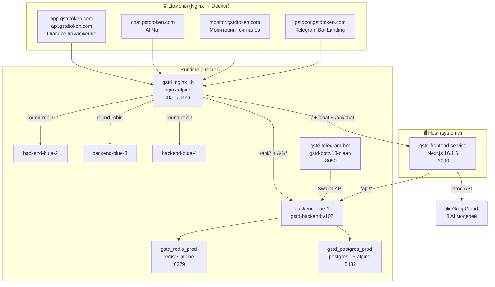
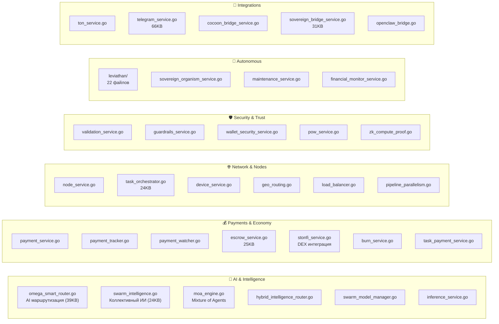
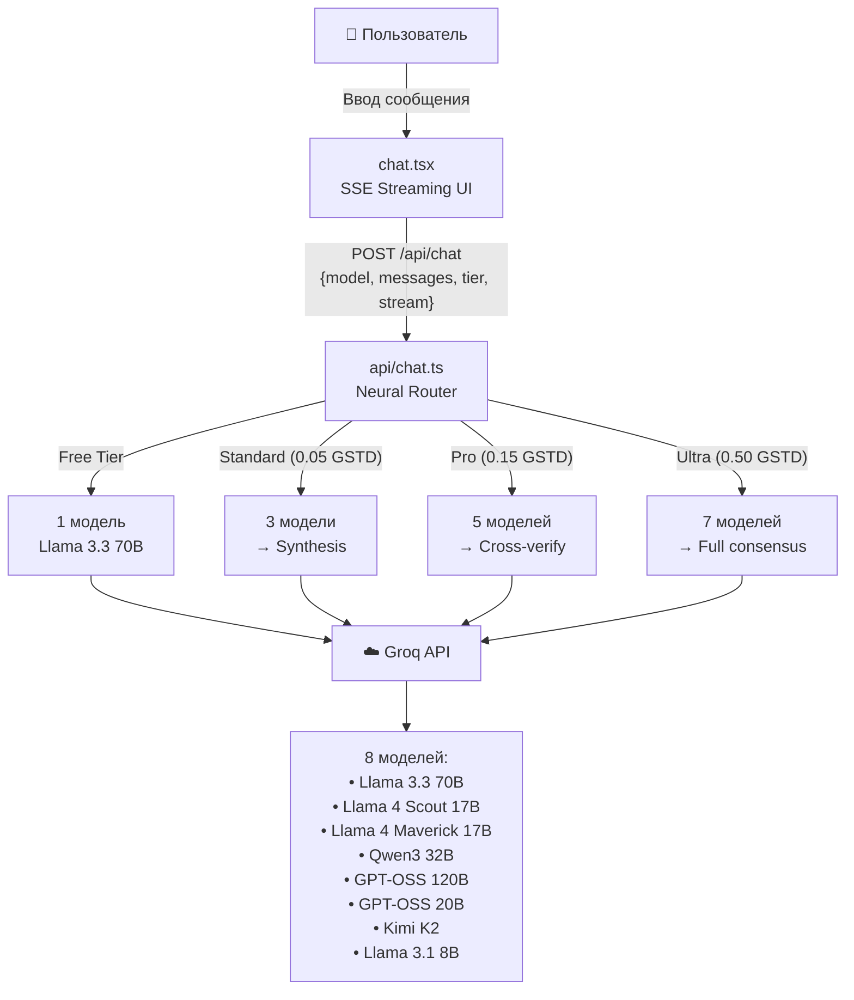
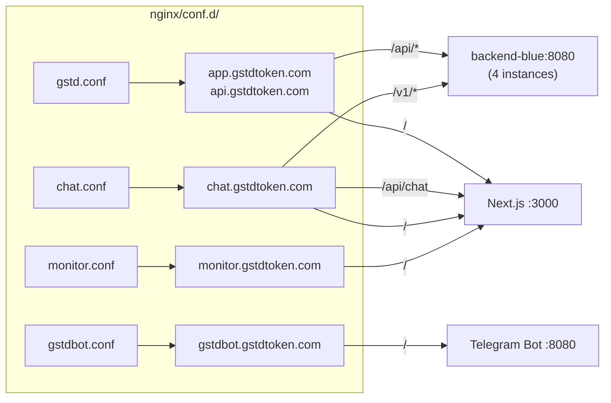
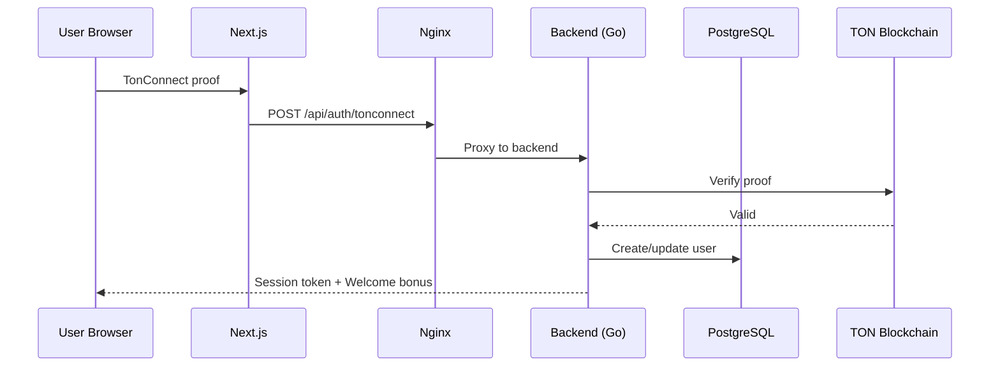
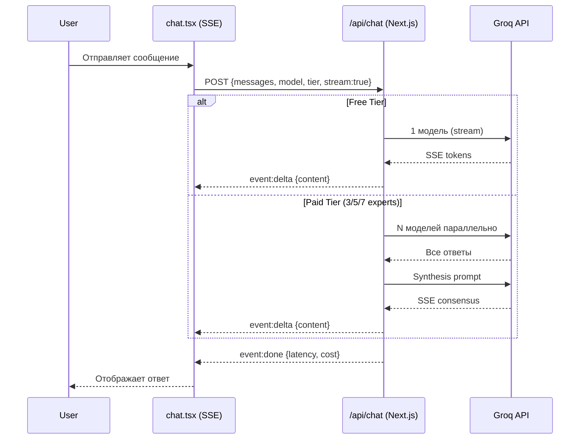
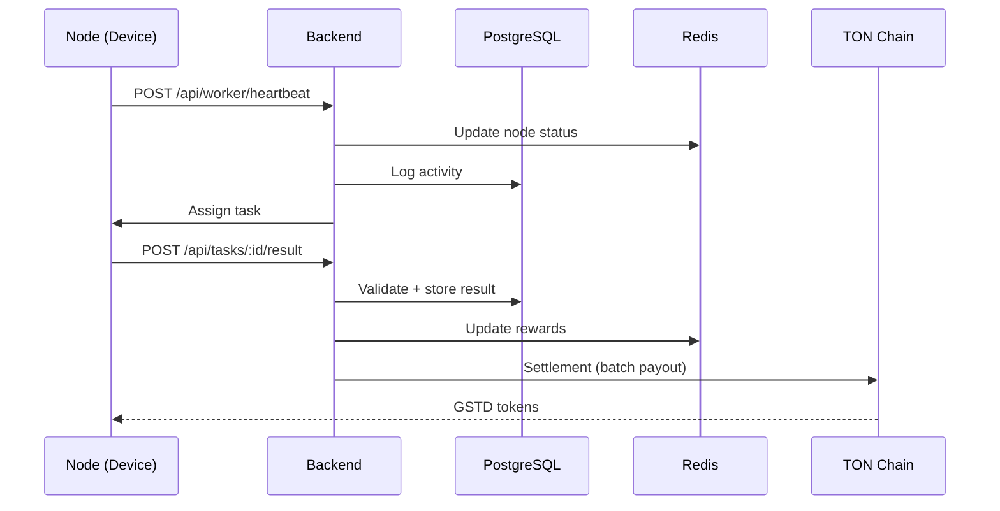

# 🏗️ GSTD Platform — Полная архитектура проекта

> **Последнее обновление**: 2026-03-06T04:57:00Z
> **Статус**: ✅ Все сервисы активны и работают

---

## 📌 Общая картина

GSTD — децентрализованная AI-платформа (DePIN) на TON блокчейне. Пользователи подключают вычислительные мощности, зарабатывают токены GSTD, используют Collective Intelligence (AI чат) и участвуют в решении глобальных задач.



---

## 🧱 Компоненты проекта

### 1. 🏠 Структура директорий

| Директория | Технология | Размер | Описание |
|---|---|---|---|
| `/home/ubuntu/backend` | **Go 1.24** (Gin) | 394M | Основной API + бизнес-логика |
| `/home/ubuntu/frontend` | **Next.js 16.1.6** (React, TypeScript, Tailwind) | 1.4G | Веб-интерфейс + AI Chat API |
| `/home/ubuntu/gstdbot` | **TypeScript** (Node.js) | 113M | Telegram-бот с AI |
| `/home/ubuntu/contracts` | **Tact** (TON) | 81M | Смарт-контракты |
| `/home/ubuntu/A2A` | **Python** | 20M | Agent-to-Agent протокол |
| `/home/ubuntu/nginx` | **Nginx** | 196K | Конфиги reverse-proxy |

---

## 🔵 Backend (Go)

**Путь**: `/home/ubuntu/backend`
**Язык**: Go 1.24 · Gin Framework · CGO (h3-geo)
**Docker**: `gstd-backend-blue:v102` × 4 инстанса (Blue-Green)
**Port**: 8080 (внутри Docker)
**Entry**: `main.go` → `internal/app/` (DI Container)

### Основные пакеты

```
backend/
├── main.go                    # Entry point → DI Container
├── cmd/                       # CLI утилиты
├── internal/
│   ├── app/                   # DI Container (BuildContainer)
│   ├── config/                # Загрузка конфигурации из ENV
│   ├── database/              # PostgreSQL подключение
│   ├── models/                # DB модели (user, task, device...)
│   ├── repository/            # Data Access Layer
│   ├── api/                   # HTTP handlers + routes (66 файлов)
│   │   ├── routes.go          # Главный роутер (1516 строк)
│   │   ├── routes_*.go        # Модульные маршруты
│   │   ├── middleware_*.go    # Auth, security, rate-limit
│   │   └── handler_*.go       # Request handlers
│   ├── services/              # Бизнес-логика (135+ сервисов)
│   │   ├── leviathan/         # Автономный AI-система (22 файла)
│   │   └── multichain/        # Cross-chain функции
│   ├── hive/                  # Hive Memory (коллективная память)
│   ├── inference/             # AI inference routing
│   ├── sentinel/              # Мониторинг безопасности
│   ├── genesis/               # Начальная инициализация
│   ├── node/                  # Управление нодами
│   ├── queue/                 # Очереди задач
│   └── settlement/            # On-chain расчёты
└── migrations/                # SQL миграции (95 файлов)
```

### Ключевые сервисы бэкенда



### API Routes (основные группы)

| Группа | Файл | Описание |
|---|---|---|
| Core | `routes.go` | Основные маршруты: `/api/health`, `/api/tasks`, `/api/wallet`, `/api/stats` |
| Admin | `routes_admin.go` | Панель администратора |
| Nodes | `routes_node.go` | Управление нодами |
| Orchestrator | `routes_orchestrator.go` | Распределение задач |
| Sovereign | `routes_sovereign.go` | Sovereign Organism / Bridge |
| Market | `routes_market.go` | DEX / ценообразование |
| Stats | `routes_stats.go` | Аналитика и статистика |
| A2A | `routes_a2a.go` | Agent-to-Agent протокол |
| Bridge | `routes_bridge.go` | Cross-chain мосты |
| Device | `routes_device.go` | Устройства / DePIN |
| Monitor | `routes_monitor.go` | Мониторинг сигналов |
| Referral | `routes_referral.go` | Реферальная система |
| User | `routes_user.go` | Пользователи |

---

## 🟢 Frontend (Next.js)

**Путь**: `/home/ubuntu/frontend`
**Фреймворк**: Next.js 16.1.6 · React · TypeScript · TailwindCSS
**Systemd**: `gstd-frontend.service` (standalone mode)
**Port**: 3000 (localhost)
**Env**: `/home/ubuntu/frontend/.env` (через `EnvironmentFile` в systemd)

### Страницы

| Страница | Файл | Описание |
|---|---|---|
| `/` (Landing) | `index.tsx` | Главная страница — DePIN Landing |
| `/chat` | `chat.tsx` (47KB) | AI Чат — 8 моделей через Groq |
| `/dashboard` | `dashboard.tsx` | Личный кабинет |
| `/hive` | `hive.tsx` | Hive Memory — коллективная память |
| `/monitor/*` | `monitor/` | Мониторинг глобальных сигналов |
| `/stats` | `stats.tsx` | Статистика платформы |
| `/about` | `about.tsx` | О платформе |
| `/docs` | `docs.tsx` | Документация |
| `/import` | `import.tsx` | Импорт агентов |
| `/tma` | `tma.tsx` | Telegram Mini App |
| `/admin/*` | `admin/` | Админ-панель |
| `/network/*` | `network/` | Сетевая карта |

### API Routes (Next.js)

| Endpoint | Файл | Описание |
|---|---|---|
| `POST /api/chat` | `pages/api/chat.ts` | **Neural Router** — Collective Intelligence (Groq) |

### Компоненты (72 файла)

```
frontend/src/components/
├── dashboard/       # 37 компонентов — основной кабинет
├── common/          # 9 общих UI компонентов
├── layout/          # 6 layout компонентов
├── home/            # 3 landing-компонента
├── tma/             # 4 Telegram Mini App
├── agent/           # 1 — агенты
├── agents/          # 1 — реестр агентов
├── marketplace/     # 1 — маркетплейс
├── referrals/       # 1 — рефералы
├── stats/           # 1 — статистика
├── ui/              # 1 — UI primitives
├── WalletConnect.tsx     # TON Connect
├── SovereignSwitch.tsx   # 20KB — главный переключатель
├── TokenEarnPanel.tsx    # 14KB — панель заработка
├── OnboardingWizard.tsx  # Онбординг
└── LeviathanLiveTicker.tsx # Live данные
```

### AI Chat Architecture



---

## 🟠 Telegram Bot (gstdbot)

**Путь**: `/home/ubuntu/gstdbot`
**Язык**: TypeScript · Node.js
**Docker**: `gstd-bot:v13-clean` (контейнер `gstd-telegram-bot`)
**Port**: 8080 (внутренний)
**Landing**: `gstdbot.gstdtoken.com` → `web/index.html`

### Структура

```
gstdbot/src/
├── index.ts           # Entry: OmegaGateway + TelegramChannel
├── gateway/           # HTTP API сервер
├── channels/          # Telegram (grammY)
├── agent/             # AI агент
├── swarm/             # Swarm intelligence
├── skills/            # Навыки бота
├── tools/             # Утилиты
├── wallet/            # TON кошелёк
├── config/            # Конфигурация
├── dashboard/         # Web-дашборд
└── cli/               # CLI интерфейс
```

---

## ⛓️ Smart Contracts (TON/Tact)

**Путь**: `/home/ubuntu/contracts`
**Язык**: Tact (TON)

| Контракт | Файл | Описание |
|---|---|---|
| **GSTDJetton** | `GSTDJetton.tact` (12KB) | Основной токен GSTD (Jetton стандарт TON) |
| **AgentRegistry** | `AgentRegistry.tact` (11KB) | Реестр AI-агентов on-chain |
| **DAOVoting** | `DAOVoting.tact` (10KB) | Голосование и управление |
| **SettlementMaster** | `SettlementMaster.tact` (9KB) | Расчёты за вычисления |
| **TreasuryGold** | `TreasuryGold.tact` (7KB) | Золотой резерв (обеспечение) |
| **Escrow** | `escrow.tact` / `escrow_complete.tact` | Эскроу для задач |

---

## 🤖 A2A Protocol (Agent-to-Agent)

**Путь**: `/home/ubuntu/A2A`
**Язык**: Python

```
A2A/
├── src/gstd_a2a/           # Основной пакет
├── swarm/                   # Swarm intelligence
├── examples/                # Примеры интеграции
├── skills/                  # Навыки агентов
├── tools/                   # Утилиты
├── starter-kit/             # Быстрый старт
├── docs/                    # Документация
├── manifest.json            # A2A манифест
├── ai-agents.json           # Реестр агентов
└── setup.py                 # Python package
```

---

## 🌐 Nginx (Reverse Proxy)

**Docker**: `gstd_nginx_lb` (nginx:alpine)
**Ports**: 80 (→301 HTTPS), 443 (SSL)
**SSL**: Let's Encrypt (certbot)

### Конфигурация доменов



---

## 🗄️ Database (PostgreSQL)

**Docker**: `gstd_postgres_prod` (postgres:15-alpine)
**Database**: `distributed_computing`
**Таблицы**: 102 таблиц

### Основные группы таблиц

| Группа | Таблицы | Описание |
|---|---|---|
| **Пользователи** | `users`, `user_wallets`, `user_achievements`, `user_api_keys` | Аккаунты и кошельки |
| **Задачи** | `tasks`, `task_contributions`, `task_escrow`, `simple_tasks_completed` | Вычислительные задачи |
| **Устройства** | `devices`, `mobile_capabilities`, `mobile_sessions` | DePIN ноды |
| **Ноды** | `nodes`, `node_metadata`, `pipeline_nodes`, `pipeline_sessions` | Вычислительная сеть |
| **Платежи** | `payout_history`, `payout_intents`, `payout_transactions`, `processed_payments` | Финансы |
| **Агенты** | `agent_registry`, `agent_api_keys`, `agent_knowledge`, `agent_reviews` | AI агенты |
| **Рефералы** | `referrals`, `referral_rewards`, `pending_referrals` | MLM система |
| **Мост** | `bridge_sessions`, `bridge_swaps`, `bridge_tasks`, `bridge_metrics` | Cross-chain |
| **Токенометрика** | `token_burns`, `burn_totals`, `golden_reserve_log`, `earnings_history` | Экономика |
| **Telegram** | `telegram_users`, `stars_payments`, `stars_purchases` | Telegram интеграция |
| **Monitor** | `monitor_signals`, `monitor_sponsorships` | Глобальные сигналы |
| **Swarm** | `swarm_intelligence_log`, `swarm_models` | ИИ модели |
| **Security** | `guardrail_violations`, `pow_challenges`, `pow_audit_log`, `wallet_access_log` | Безопасность |

---

## 📡 Redis

**Docker**: `gstd_redis_prod` (redis:7-alpine)
**Port**: 6379

**Использование**:
- Session tokens
- Rate limiting
- PubSub (real-time events)
- Кеширование (цены, балансы)
- Streams (telemetry)
- Task queue
- Leviathan state

---

## 🔧 Systemd Services

| Сервис | Описание | Файл |
|---|---|---|
| `gstd-frontend.service` | Next.js standalone (:3000) | `/etc/systemd/system/gstd-frontend.service` |
| `gstd-backend.service` | Docker backend orchestration | `/etc/systemd/system/gstd-backend.service` |
| `gstd-api.service` | API server | `/etc/systemd/system/gstd-api.service` |

---

## 🔑 Environment Variables

### Backend (`/home/ubuntu/backend/.env`)

| Группа | Переменные |
|---|---|
| **Database** | `DB_HOST`, `DB_PORT`, `DB_USER`, `DB_PASSWORD`, `DB_NAME`, `DB_SSLMODE` |
| **Redis** | `REDIS_HOST`, `REDIS_PORT`, `REDIS_PASSWORD` |
| **TON** | `TON_API_KEY`, `TON_API_URL`, `GSTD_JETTON_ADDRESS`, `TREASURY_WALLET`, `PLATFORM_WALLET_ADDRESS`, `TON_CONTRACT_ADDRESS` |
| **AI Models** | `GROQ_API_KEY`, `OPENAI_API_KEY`, `ANTHROPIC_API_KEY`, `GEMINI_API_KEY`, `DEEPSEEK_API_KEY`, `OPENROUTER_API_KEY`, `OLLAMA_URL` |
| **Telegram** | `TELEGRAM_BOT_TOKEN`, `TELEGRAM_CHAT_ID` |
| **Security** | `BRIDGE_ENCRYPTION_KEY`, `ADMIN_API_KEY`, `ADMIN_WALLET` |
| **Bridges** | `COCOON_BRIDGE_ENABLED`, `COCOON_PROXY_URL`, `COCOON_API_KEY` |
| **Other** | `LEVIATHAN_ENABLED`, `LITELLM_URL`, `HF_TOKEN`, `BOINC_MASTER_KEY` |

### Frontend (`/home/ubuntu/frontend/.env`)

| Переменная | Описание |
|---|---|
| `GROQ_API_KEY` | API ключ Groq для AI Chat |
| `GSTD_SWARM_URL` | URL бэкенда (http://localhost:8080) |
| `NODE_ENV` | production |

> ⚠️ **ВАЖНО**: Frontend `.env` подключается через `EnvironmentFile=` в systemd. Next.js standalone **не читает `.env` автоматически** в runtime!

---

## 🚀 Процесс деплоя

### Backend (Blue-Green Deployment)

```bash
# 1. Билд
cd /home/ubuntu/backend
docker build -t gstd-backend-blue:vNEW .

# 2. Обновление docker-compose и перезапуск
docker compose up -d --scale backend-blue=4
```

### Frontend

```bash
# 1. Билд
cd /home/ubuntu/frontend
npm run build

# 2. Перезапуск сервиса
sudo systemctl restart gstd-frontend
```

### Telegram Bot

```bash
# 1. Билд
cd /home/ubuntu/gstdbot
docker build -t gstd-bot:vNEW .

# 2. Перезапуск
docker stop gstd-telegram-bot && docker rm gstd-telegram-bot
docker run -d --name gstd-telegram-bot ...
```

---

## 📊 Текущий статус (2026-03-06)

| Компонент | Статус | Версия | Uptime |
|---|---|---|---|
| Nginx LB | ✅ Active | alpine | 4 days |
| Backend ×4 | ✅ Healthy | v102 | 9 hours |
| Frontend | ✅ Active | Next.js 16.1.6 | Свежий рестарт |
| Telegram Bot | ✅ Active | v13-clean | 9 hours |
| PostgreSQL | ✅ Healthy | 15-alpine | 7 days |
| Redis | ✅ Healthy | 7-alpine | 7 days |
| AI Chat (Groq) | ✅ Working | 8 models | — |

---

## 🐛 Известные проблемы (решённые)

| Дата | Проблема | Причина | Решение |
|---|---|---|---|
| 2026-03-06 | Chat "All models unavailable" | `GROQ_API_KEY` не передавался в standalone Next.js | Добавлен `EnvironmentFile=` в systemd |
| 2026-03-05 | Chat не отображается | Проблемы со сборкой Next.js | Ребилд + рестарт |
| 2026-03-03 | Chat не работает | Backend API ошибки | Исправление конфигурации nginx |
| 2026-03-01 | CSP ошибки | Content Security Policy блокировал TonConnect | Обновление CSP в nginx |

---

## 🔄 Потоки данных

### 1. Пользователь подключает кошелёк



### 2. AI Chat (Collective Intelligence)



### 3. DePIN Node вычисляет задачу



---

## 📝 Правила обновления этого документа

> При каждом значительном изменении в проекте (новая страница, сервис, контракт, изменение инфраструктуры, смена версий) — **обновить этот документ**, включая:
> 1. Диаграммы Mermaid
> 2. Таблицу текущего статуса
> 3. Таблицу известных проблем
> 4. Версии и uptime
> 5. Новые переменные окружения
> 6. Новые API routes
